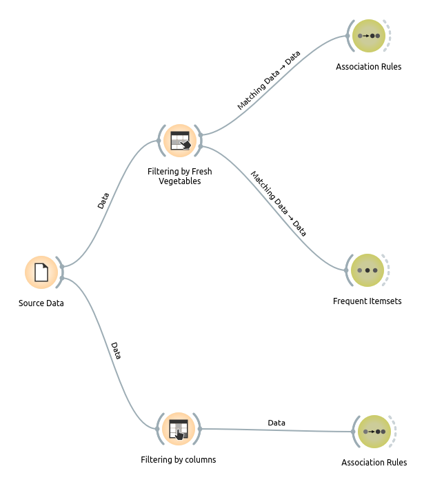
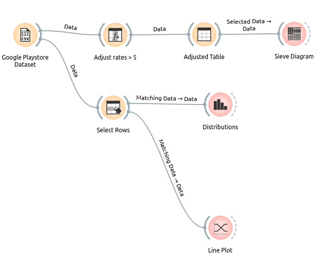
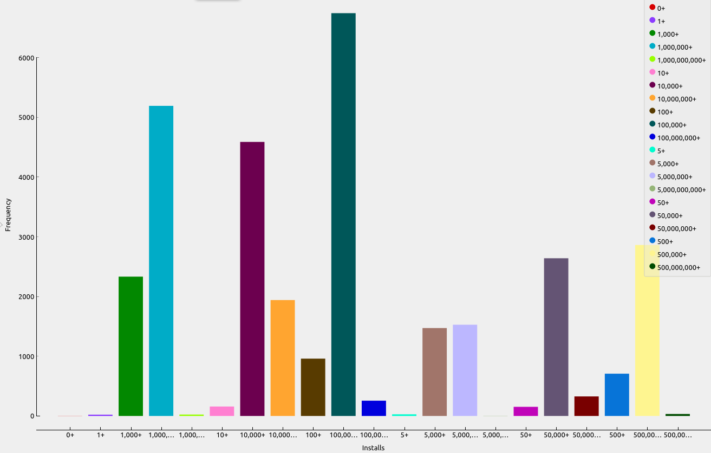
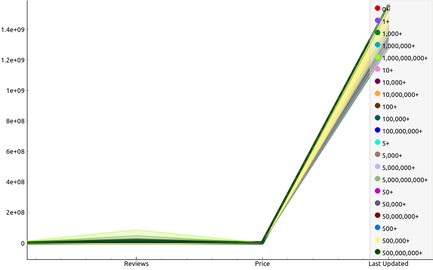
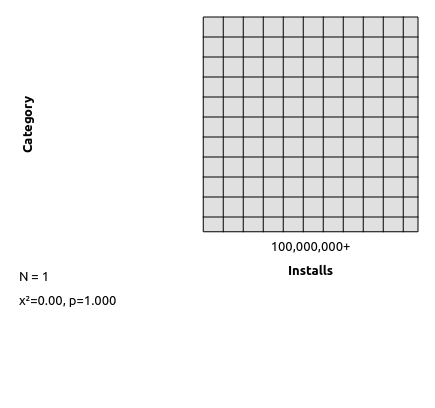
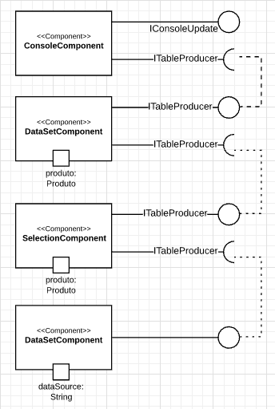
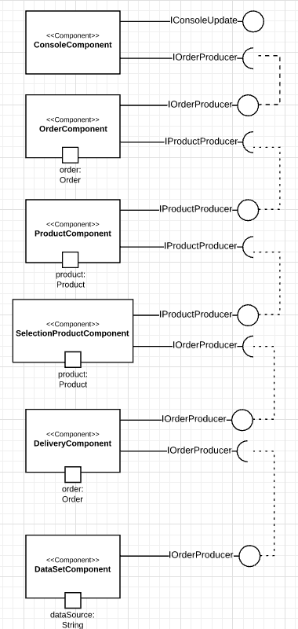
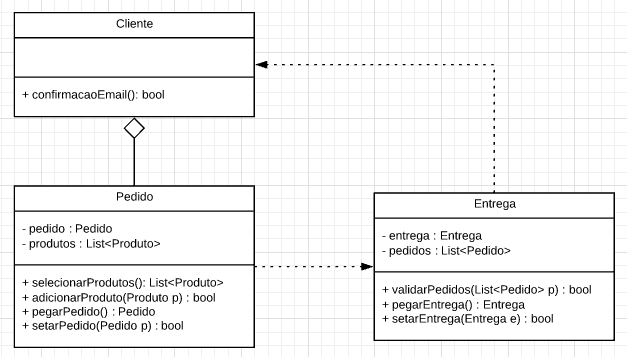

# Aluno
* Felipe Emygdio de Salles

# Projeto Orange / Regras de Associação para Foodmart

## Imagem do Projeto
> 

## Arquivo do Projeto
> - [Foodmart.ows](orange/Foodmart/Foodmart.ows)
> - [Foodmart.csv](orange/Foodmart/Foodmart2000-association.csv)

# Projeto Orange / Análise de Dados do Google PlayStore

## Imagem do Projeto
> 

## Arquivo do Projeto
> - [PlayStore.ows](orange/PlayStore/PlayStore.ows)
> - [Play Store.csv](orange/PlayStore/Google-Playstore-32K.csv)

## Gráfico(s) de Análise
> 
> 
> 

# Projeto de Composição de Componentes para Recomendação

> 

# Projeto de Composição de Componentes para Pedido

## Diagrama de Componentes

> 

## Diagrama de Interfaces

> 