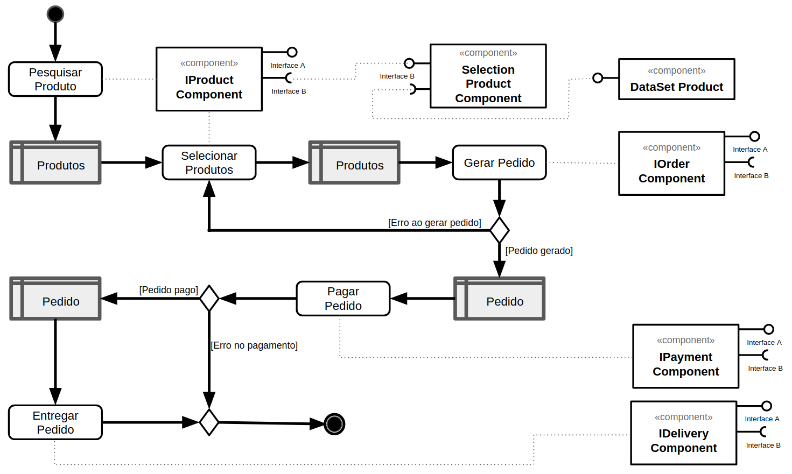

# Modelo para Apresentação do Lab03 - Model-View-Controller

## Tarefa 1
> 

## Tarefa 2
> 

## Tarefa 3
> * tela 1 - nenhum produto selecionado 

> * tela 2 - primeiro produto selecionado 

> * tela 3 - segundo produto selecionado 

> * tela 4 - compra de um dos produtos efetiva 

> * tela 5 - diagrama de blocos do aplicativo 

## Aplicação
[InterfaceCompra](app/InterfaceCompra.aia)