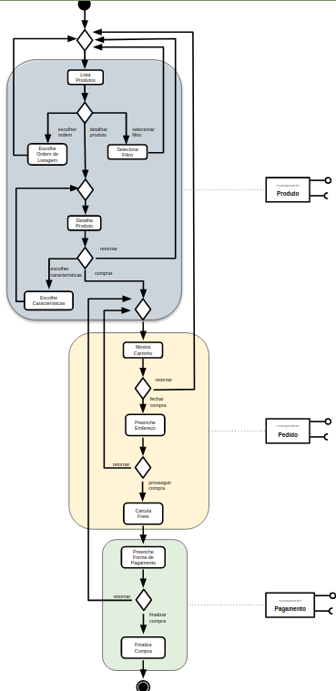
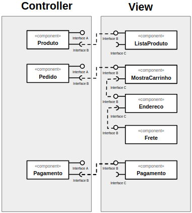
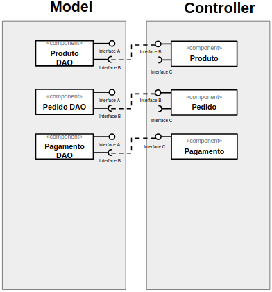

# Modelo para Apresentação do Lab04 - Serviços

## Tarefa 1
> 

## Tarefa 2
> 

## Tarefa 3
> 

## Tarefa 4

### Serviço `1`

* **Título do serviço**: `GitHub`
* **Breve descrição**:
  > Colaboração poderosa, revisão de código e gerenciamento de código para software livre e projetos privados.
* **URL completa da requisição**: `https://api.github.com/repos/sallesweb/INF331-Aula01`
* **Cabeçalho HTTP da chamada**:
~~~http
GET https://api.github.com/repos/sallesweb/INF331-Aula01 HTTP/2
User-Agent: PostmanRuntime/7.26.3
Accept: */*
Postman-Token: 23533244-f0a8-4983-b8b1-1d7df9e32e21
Host: api.github.com
Accept-Encoding: gzip, deflate, br
Connection: keep-alive
~~~
* **Cabeçalho HTTP da resposta**:
~~~http
server: GitHub.com
date: Sat, 29 Aug 2020 01:16:27 GMT
content-type: application/json; charset=utf-8
status: 200 OK
cache-control: public, max-age=60, s-maxage=60
vary: Accept, Accept-Encoding, Accept, X-Requested-With
etag: W/"2835532cbcce84bf5aaf96c1628cf4b9"
last-modified: Sat, 22 Aug 2020 02:54:08 GMT
x-github-media-type: github.v3; format=json
access-control-expose-headers: ETag, Link, Location, Retry-After, X-GitHub-OTP, X-RateLimit-Limit, X-RateLimit-Remaining, X-RateLimit-Reset, X-OAuth-Scopes, X-Accepted-OAuth-Scopes, X-Poll-Interval, X-GitHub-Media-Type, Deprecation, Sunset
access-control-allow-origin: *
strict-transport-security: max-age=31536000; includeSubdomains; preload
x-frame-options: deny
x-content-type-options: nosniff
x-xss-protection: 1; mode=block
referrer-policy: origin-when-cross-origin, strict-origin-when-cross-origin
content-security-policy: default-src 'none'
content-encoding: gzip
X-Ratelimit-Limit: 60
X-Ratelimit-Remaining: 58
X-Ratelimit-Reset: 1598666974
Accept-Ranges: bytes
Content-Length: 1332
X-GitHub-Request-Id: 90EE:61D4:EA9A2F:21134BF:5F49AC6B
~~~
* **Conteúdo da resposta**:
~~~json
{
    "id": 285920268,
    "node_id": "MDEwOlJlcG9zaXRvcnkyODU5MjAyNjg=",
    "name": "INF331-Aula01",
    "full_name": "sallesweb/INF331-Aula01",
    "private": false,
    "owner": {
        "login": "sallesweb",
        "id": 59800823,
        "node_id": "MDQ6VXNlcjU5ODAwODIz",
        "avatar_url": "https://avatars1.githubusercontent.com/u/59800823?v=4",
        "gravatar_id": "",
        "url": "https://api.github.com/users/sallesweb",
        "html_url": "https://github.com/sallesweb",
        "followers_url": "https://api.github.com/users/sallesweb/followers",
        "following_url": "https://api.github.com/users/sallesweb/following{/other_user}",
        "gists_url": "https://api.github.com/users/sallesweb/gists{/gist_id}",
        "starred_url": "https://api.github.com/users/sallesweb/starred{/owner}{/repo}",
        "subscriptions_url": "https://api.github.com/users/sallesweb/subscriptions",
        "organizations_url": "https://api.github.com/users/sallesweb/orgs",
        "repos_url": "https://api.github.com/users/sallesweb/repos",
        "events_url": "https://api.github.com/users/sallesweb/events{/privacy}",
        "received_events_url": "https://api.github.com/users/sallesweb/received_events",
        "type": "User",
        "site_admin": false
    },
    "html_url": "https://github.com/sallesweb/INF331-Aula01",
    "description": "Repositório criado para apresentação dos resultados obtidos na Aula 01 da matéria INF331 - Componentização e Reuso de Software: Conceitos e Práticas, ministrado pelo professor André Santanché na Unicamp.",
    "fork": false,
    "url": "https://api.github.com/repos/sallesweb/INF331-Aula01",
    "forks_url": "https://api.github.com/repos/sallesweb/INF331-Aula01/forks",
    "keys_url": "https://api.github.com/repos/sallesweb/INF331-Aula01/keys{/key_id}",
    "collaborators_url": "https://api.github.com/repos/sallesweb/INF331-Aula01/collaborators{/collaborator}",
    "teams_url": "https://api.github.com/repos/sallesweb/INF331-Aula01/teams",
    "hooks_url": "https://api.github.com/repos/sallesweb/INF331-Aula01/hooks",
    "issue_events_url": "https://api.github.com/repos/sallesweb/INF331-Aula01/issues/events{/number}",
    "events_url": "https://api.github.com/repos/sallesweb/INF331-Aula01/events",
    "assignees_url": "https://api.github.com/repos/sallesweb/INF331-Aula01/assignees{/user}",
    "branches_url": "https://api.github.com/repos/sallesweb/INF331-Aula01/branches{/branch}",
    "tags_url": "https://api.github.com/repos/sallesweb/INF331-Aula01/tags",
    "blobs_url": "https://api.github.com/repos/sallesweb/INF331-Aula01/git/blobs{/sha}",
    "git_tags_url": "https://api.github.com/repos/sallesweb/INF331-Aula01/git/tags{/sha}",
    "git_refs_url": "https://api.github.com/repos/sallesweb/INF331-Aula01/git/refs{/sha}",
    "trees_url": "https://api.github.com/repos/sallesweb/INF331-Aula01/git/trees{/sha}",
    "statuses_url": "https://api.github.com/repos/sallesweb/INF331-Aula01/statuses/{sha}",
    "languages_url": "https://api.github.com/repos/sallesweb/INF331-Aula01/languages",
    "stargazers_url": "https://api.github.com/repos/sallesweb/INF331-Aula01/stargazers",
    "contributors_url": "https://api.github.com/repos/sallesweb/INF331-Aula01/contributors",
    "subscribers_url": "https://api.github.com/repos/sallesweb/INF331-Aula01/subscribers",
    "subscription_url": "https://api.github.com/repos/sallesweb/INF331-Aula01/subscription",
    "commits_url": "https://api.github.com/repos/sallesweb/INF331-Aula01/commits{/sha}",
    "git_commits_url": "https://api.github.com/repos/sallesweb/INF331-Aula01/git/commits{/sha}",
    "comments_url": "https://api.github.com/repos/sallesweb/INF331-Aula01/comments{/number}",
    "issue_comment_url": "https://api.github.com/repos/sallesweb/INF331-Aula01/issues/comments{/number}",
    "contents_url": "https://api.github.com/repos/sallesweb/INF331-Aula01/contents/{+path}",
    "compare_url": "https://api.github.com/repos/sallesweb/INF331-Aula01/compare/{base}...{head}",
    "merges_url": "https://api.github.com/repos/sallesweb/INF331-Aula01/merges",
    "archive_url": "https://api.github.com/repos/sallesweb/INF331-Aula01/{archive_format}{/ref}",
    "downloads_url": "https://api.github.com/repos/sallesweb/INF331-Aula01/downloads",
    "issues_url": "https://api.github.com/repos/sallesweb/INF331-Aula01/issues{/number}",
    "pulls_url": "https://api.github.com/repos/sallesweb/INF331-Aula01/pulls{/number}",
    "milestones_url": "https://api.github.com/repos/sallesweb/INF331-Aula01/milestones{/number}",
    "notifications_url": "https://api.github.com/repos/sallesweb/INF331-Aula01/notifications{?since,all,participating}",
    "labels_url": "https://api.github.com/repos/sallesweb/INF331-Aula01/labels{/name}",
    "releases_url": "https://api.github.com/repos/sallesweb/INF331-Aula01/releases{/id}",
    "deployments_url": "https://api.github.com/repos/sallesweb/INF331-Aula01/deployments",
    "created_at": "2020-08-07T21:01:54Z",
    "updated_at": "2020-08-22T02:54:08Z",
    "pushed_at": "2020-08-22T02:54:06Z",
    "git_url": "git://github.com/sallesweb/INF331-Aula01.git",
    "ssh_url": "git@github.com:sallesweb/INF331-Aula01.git",
    "clone_url": "https://github.com/sallesweb/INF331-Aula01.git",
    "svn_url": "https://github.com/sallesweb/INF331-Aula01",
    "homepage": null,
    "size": 2323,
    "stargazers_count": 0,
    "watchers_count": 0,
    "language": "Jupyter Notebook",
    "has_issues": true,
    "has_projects": true,
    "has_downloads": true,
    "has_wiki": true,
    "has_pages": false,
    "forks_count": 0,
    "mirror_url": null,
    "archived": false,
    "disabled": false,
    "open_issues_count": 0,
    "license": null,
    "forks": 0,
    "open_issues": 0,
    "watchers": 0,
    "default_branch": "master",
    "temp_clone_token": null,
    "network_count": 0,
    "subscribers_count": 1
}
~~~

### Serviço `2`

* **Título do serviço**: `EU BON UTIS`
* **Breve descrição**:
  > O Serviço de Informação Taxonômica Unificada (UTIS) é a espinha dorsal taxonômica para do projeto EU-BON.
* **URL completa da requisição**: `http://cybertaxonomy.eu/eu-bon/utis/1.0/search?query=Prionus&providers=eunis&searchMode=scientificNameLike&addSynonymy=true&timeout=0`
* **Cabeçalho HTTP da chamada**:
~~~http
GET http://cybertaxonomy.eu/eu-bon/utis/1.0/search?query=Prionus&providers=eunis&searchMode=scientificNameLike&addSynonymy=true&timeout=0 HTTP/2
User-Agent: PostmanRuntime/7.26.3
Accept: */*
Postman-Token: 7f5aa5b0-e74a-43fc-848c-f8806db74cf4
Host: cybertaxonomy.eu
Accept-Encoding: gzip, deflate, br
Connection: keep-alive
Referer: http://cybertaxonomy.eu/eu-bon/utis/1.3/search?query=Prionus&providers=eunis&searchMode=scientificNameLike&addSynonymy=true&timeout=0
~~~
* **Cabeçalho HTTP da resposta**:
~~~http
Date: Sat, 29 Aug 2020 01:43:50 GMT
Server: Jetty(8.1.16.v20140903)
Access-Control-Allow-Origin: *
Access-Control-Allow-Methods: POST, GET, OPTIONS, DELETE
Access-Control-Max-Age: 3600
Access-Control-Allow-Headers: x-requested-with
Content-Type: application/json;charset=UTF-8
Keep-Alive: timeout=5, max=99
Connection: Keep-Alive
Transfer-Encoding: chunked

~~~
* **Conteúdo da resposta**:
~~~json
{
    "query": [
        {
            "request": {
                "queryString": "Prionus",
                "searchMode": "scientificNameLike",
                "addSynonymy": true,
                "addParentTaxon": false,
                "pageSize": 20,
                "pageIndex": 0
            },
            "response": [],
            "clientStatus": [
                {
                    "checklistId": "eunis",
                    "duration": null,
                    "statusMessage": "ok"
                }
            ]
        }
    ]
}
~~~