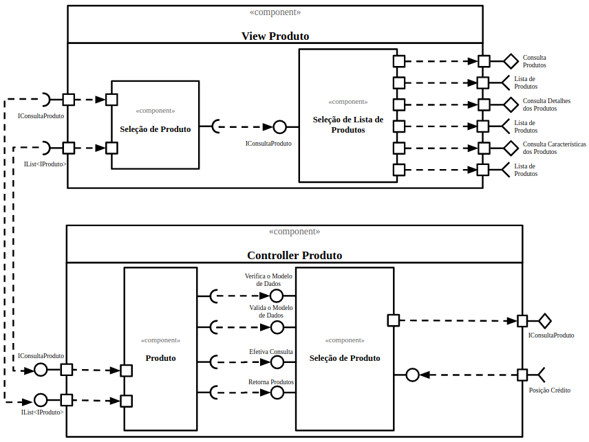

# Modelo para Apresentação do Lab05 - Subcomponentes e Páginas Dinâmicas

## Tarefa 1
> 

## Tarefa 2
Link para o projeto no Codepen: [React 03 - Componente de Escrita de Texto Parametrizável](https://codepen.io/sallesweb/pen/BaKmdBX)

**HTML**
~~~html

~~~

**JavaScript**
~~~javascript
class WriteText extends React.Component {
    render() {
        return 
{this.props.text}
;
    }
}

const elemento = 

    <h2>Criação de texto por componente:</h2>
    <WriteText
        text="Texto vermelho tamanho: 18px"
        fontSize="18px"
        color="#FF0000"/>
    <WriteText
        text="Texto verde tamanho: 'large'"
        fontSize="large"
        color="#00FF00"/>
    <WriteText
        text="Texto azul tamanho: 250%"
        fontSize="250%"
        color="#0000FF"/>
    <WriteText
        text="Texto preto negrito tamanho: 14px"
        fontSize="14px"
        color="#000000"
        fontWeight="bold"/>

;

ReactDOM.render(elemento, document.getElementById("root"));
~~~